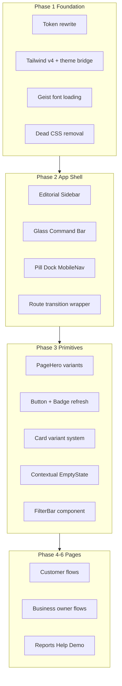

# Lattice App UI Overhaul

## Problem diagnosis

The in-app UI reads as a **generic blue SaaS admin panel** disconnected from the polished Lumio landing ([`public/lumio/styles.css`](public/lumio/styles.css)). Root causes:

- **No brand fonts loaded** in [`index.html`](index.html) — app falls back to system UI while landing uses Geist + Instrument Serif
- **Unresolved palette tension** — warm brown ink tokens vs cool blue surfaces in [`src/styles/tokens.css`](src/styles/tokens.css)
- **One visual grammar everywhere** — white card + `1px` border + `shadow-sm` repeated across discovery, dashboard, lists, and empty states
- **~40% dead CSS** — "Premium overrides" in [`components.css`](src/styles/components.css), [`discovery.css`](src/styles/discovery.css), [`business.css`](src/styles/business.css) and orphaned `.ping-radar-*` in [`forms.css`](src/styles/forms.css) are overwritten by "Light corrections" and never render
- **Split quality** — [`CreatePingPage.tsx`](src/pages/CreatePingPage.tsx) and [`HomePage.tsx`](src/pages/HomePage.tsx) have custom layouts; the other ~15 pages share identical `PageHeader → toolbar → grid → EmptyState` scaffolding

**Scope:** All routes inside `AppLayout`. **Out of scope:** Lumio iframe at `#/`, `#/landing`.

**Taste-skill baselines applied:** DESIGN_VARIANCE 8 (asymmetric layouts), MOTION_INTENSITY 6 (spring physics, staggered reveals), VISUAL_DENSITY 4 (airy, editorial spacing).

**Styling approach (your choice):** Hybrid — Tailwind v4 for layout, spacing, typography utilities, and new motion wrappers; existing BEM CSS retained and gradually migrated for complex domain components.

---

## Target visual direction

Bridge Lumio's editorial identity into a **product-grade asymmetric interface**:

| Dimension | Today | Target |
|-----------|-------|--------|
| Typography | 14px system sans | Geist + Geist Mono; Instrument Serif for display accents on customer pages |
| Palette | Cool blue `#0b5cff` on warm ink | Lumio-aligned: ink `#0E0A07`, paper `#FEFEFE`, accent `#18498B` (single desaturated blue — no purple/neon) |
| Layout | Centered headers + uniform card grids | Split heroes, bento zones, horizontal scroll rails, zig-zag feature rows |
| Surfaces | Flat white boxes | Liquid-glass topbar/sidebar, diffusion shadows, border-t grouping instead of card walls |
| Motion | 180ms CSS everywhere | `motion` spring reveals, route transitions, isolated perpetual micro-animations in KPI tiles |
| Empty states | Centered dashed boxes | Contextual illustrated empties with directional CTAs |



---

## Phase 1 — Design foundation (hybrid stack)

### 1a. Install Tailwind v4 + wire Vite

```bash
npm install tailwindcss @tailwindcss/vite
```

- Add `@tailwindcss/vite` plugin to [`vite.config.ts`](vite.config.ts)
- In [`src/styles/globals.css`](src/styles/globals.css): `@import "tailwindcss"` **before** existing imports; add `@theme` block mapping Lumio tokens to Tailwind theme keys (`--color-ink`, `--font-sans`, `--radius-2xl`, etc.)
- CSS variables in [`tokens.css`](src/styles/tokens.css) remain the **single source of truth**; Tailwind utilities reference them so BEM and utilities stay in sync

### 1b. Rewrite [`tokens.css`](src/styles/tokens.css)

Align with Lumio palette and fix broken tokens:

- Replace accent family with `#18498B` / `#2352DE` / `#3372D9`
- Ink: `#0E0A07`; paper: `#FEFEFE`; muted text via `rgba(14,10,7,.45)`
- Add missing `--mint` or remove all references
- Typography scale: body `15–16px`, display `clamp()` sizes up to `3.5rem`
- Radius: major containers `2.5rem` (taste-skill bento paradigm); pills unchanged
- Shadows: diffusion-style `0 20px 40px -15px rgba(14,10,7,0.06)` tinted to ink hue
- Glass tokens: actually used (not overridden away)

### 1c. Load fonts in [`index.html`](index.html)

```html
<link rel="preconnect" href="https://fonts.googleapis.com" />
<link href="https://fonts.googleapis.com/css2?family=Geist+Mono&family=Instrument+Serif:ital@0;1&display=swap" rel="stylesheet" />
```

(Geist may use `npm`/`@fontsource` if Google CDN unavailable — verify at install time.)

### 1d. CSS purge and consolidation

Delete entirely:
- Premium/Light-correction override blocks in `components.css`, `discovery.css`, `business.css`
- Orphaned `.ping-radar-*` block in `forms.css` (~400 lines)
- Misnamed `.text-gradient` (solid color) — replace with real gradient utility or remove

Reorganize stylesheets into clearer layers:
- `tokens.css` — variables only
- `globals.css` — reset, shell, Tailwind import, utilities
- `primitives.css` (extracted from `components.css`) — btn, badge, modal, tabs
- `forms.css`, `discovery.css`, `business.css`, `reports.css` — domain styles, rewritten not patched

---

## Phase 2 — App shell transformation

The shell is the highest-leverage change — users see it on every route.

### [`AppLayout.tsx`](src/components/layout/AppLayout.tsx)

- Add fixed ambient background layer (subtle mesh gradient / grain on `pointer-events-none` pseudo-element per taste-skill performance rules)
- Wrap `route-fade` in a client `RouteTransition` component using `motion` `AnimatePresence` + `layout` — spring `stiffness: 100, damping: 20`
- Widen content rhythm: asymmetric padding (`pl-[max(1.5rem,5vw)]` on desktop) instead of centered max-width box everywhere

### [`Sidebar.tsx`](src/components/layout/Sidebar.tsx) — editorial rail

Replace flat white nav list with:
- Compact brand lockup matching Lumio wordmark weight
- Nav groups with **left accent bar** on active route (not full background fill)
- Icon + label with subtle hover slide (`translateX(2px)`)
- Optional: collapsed icon-rail mode at `lg:` with expand on hover — reduces visual weight

### [`TopBar.tsx`](src/components/layout/TopBar.tsx) — glass command bar

- Liquid glass: `backdrop-blur`, `border-white/10`, inset highlight
- Location as a **pill command** (not plain text)
- Profile/business switchers as compact avatar chips with dropdown panels using glass surfaces
- Remove warm-cream / cool-blue clash

### [`MobileNav.tsx`](src/components/layout/MobileNav.tsx) — floating dock

- Mac-dock-inspired pill bar: `rounded-full`, diffusion shadow, scale-on-active icon
- Center "Ping" action elevated (primary FAB slot) — this is the core product action

### [`globals.css`](src/styles/globals.css) shell CSS

Rewrite `.app-shell`, `.sidebar`, `.topbar`, `.mobile-nav`, `.app-content` to match new components; use Tailwind `@apply` sparingly for shell-only layout.

---

## Phase 3 — Primitive component system

### Replace [`PageHeader.tsx`](src/components/layout/PageHeader.tsx) with `PageHero`

New component with **3 variants** (used by archetype, not one-size-fits-all):

| Variant | Used on | Layout |
|---------|---------|--------|
| `split` | Explore, Matches, Saved | Left: serif-accent title + subtitle; Right: stats pill or live count |
| `command` | Home, Business Dashboard | Full-width asymmetric hero (extend existing `home-command` pattern) |
| `compact` | Claims, Rankings, Manage Offers | Minimal top band — title + inline actions, no wasted vertical space |

Eyebrow dot pattern retired in favor of **mono kickers** (`font-mono text-xs tracking-widest uppercase`).

### [`Card.tsx`](src/components/common/Card.tsx) — variant prop

```ts
variant: "surface" | "glass" | "inset" | "bento" | "ghost"
```

- `surface` — white + diffusion shadow (default)
- `glass` — liquid glass panel for overlays/previews
- `inset` — no shadow, `border-t` grouping for lists (anti-card-overuse at density 4)
- `bento` — `rounded-[2.5rem] p-8` large tile for dashboard features
- `ghost` — no border, spacing-only

### [`Button.tsx`](src/components/common/Button.tsx) + [`Badge.tsx`](src/components/common/Badge.tsx)

- Primary: deep blue with inset highlight (match Lumio CTA), `:active` scale `0.98`
- Secondary: ghost with ink border
- Directional hover fill (CSS `::before` from mouse-enter side) on primary CTAs
- Badges: desaturated semantic colors, mono for numeric badges

### [`EmptyState.tsx`](src/components/common/EmptyState.tsx)

- **Left-aligned** composition (anti-center bias)
- Variant illustrations via CSS composition (not emoji): radar rings for matches, map pin grid for explore, ticket stub for claims
- Primary CTA always present and contextual

### New shared components

| Component | Purpose |
|-----------|---------|
| `FilterBar` | Replace native `<select>` toolbars on Explore/Matches — pill toggles, segmented controls, search with icon |
| `ScrollRail` | Horizontal snap-scroll for card collections (featured deals, categories) |
| `RichListRow` | Thumbnail + title + meta + trailing action — replaces plain `ul` rows |
| `MetricTile` | Animated KPI with isolated `motion` client child (count-up, breathing dot) |
| `RouteTransition` | Client-only page enter/exit wrapper |

---

## Phase 4 — Customer experience pages

### [`HomePage.tsx`](src/pages/HomePage.tsx) — command center bento

Evolve existing `home-command` into a **2-column asymmetric bento dashboard**:

```
[ Command hero + CTA          ] [ Live activity stream    ]
[ 2x2 metric bento tiles      ] [ Active claims rich list ]
[ Horizontal category scroll  ] [ Trending deals rail     ]
```

- Metric tiles get perpetual micro-animation (MetricTile)
- Category section: `ScrollRail` with category photo chips, not a flat Card list
- Claims/deals: `RichListRow` with business thumbnails

### [`CreatePingPage.tsx`](src/pages/CreatePingPage.tsx) — refine, don't rebuild

Already the best page. Focused upgrades:
- Consolidate inline preview with orphaned [`RequestPreview.tsx`](src/components/ping/RequestPreview.tsx) (delete duplicate markup)
- Apply new tokens/glass to `studio-preview` floating card
- Staggered section reveals via `motion` variants on `StudioSection`
- Upgrade chip selectors to match new `FilterBar` pill aesthetic

### [`ExplorePage.tsx`](src/pages/ExplorePage.tsx) — editorial discovery

Biggest transformation of a "template" page:
- `PageHero split` with live business count
- `FilterBar` replacing 4 native selects
- **Featured row** (1 large + 2 small asymmetric) above the grid
- Remaining results in `biz-grid` with refreshed [`BusinessCard.tsx`](src/components/businesses/BusinessCard.tsx)
- Category quick-jump horizontal rail

### [`MatchesPage.tsx`](src/pages/MatchesPage.tsx) — match results as editorial feed

- Split hero showing ping summary sentence (reuse ping preview styling)
- Sort/filter as segmented control + chip row (not bare select)
- [`OfferCard.tsx`](src/components/offers/OfferCard.tsx) visually **distinct** from BusinessCard: price-forward layout, match score as radial gauge not flat badge
- Top match gets "featured" full-width treatment

### [`ClaimsPage.tsx`](src/pages/ClaimsPage.tsx) + [`SavedPage.tsx`](src/pages/SavedPage.tsx)

- Tabbed views with underline animation (not boxed tabs)
- `RichListRow` with offer thumbnail, expiry countdown (mono), status pill
- Saved: masonry-style 2-column card layout at `md:` instead of uniform grid

### [`BusinessProfilePage.tsx`](src/pages/BusinessProfilePage.tsx)

- Full-bleed header image with gradient scrim
- Sticky mini-nav (Offers / Details / Reviews)
- Offer cards in horizontal scroll within profile context

### [`RankingsPage.tsx`](src/pages/RankingsPage.tsx) + [`HelpPage.tsx`](src/pages/HelpPage.tsx)

- Rankings: podium visualization for top 3, then `RichListRow` list
- Help: zig-zag step layout (image left / text right alternating) — **not** `metric-grid` of identical cards

---

## Phase 5 — Business owner pages

Slightly higher information density (still density 4, not cockpit mode):

### [`BusinessDashboardPage.tsx`](src/pages/BusinessDashboardPage.tsx)

- `PageHero command` with business name + today's pulse line
- Bento KPI grid (4 tiles, 2fr/1fr/1fr asymmetric) with `MetricTile` animations
- Recent claims as `RichListRow` with customer avatar initials
- Quick actions as **icon tiles** not `dash-link` text buttons

### [`ManageOffersPage.tsx`](src/pages/ManageOffersPage.tsx) + [`CreateOfferPage.tsx`](src/pages/CreateOfferPage.tsx)

- [`OwnerOfferRow.tsx`](src/components/business/OwnerOfferRow.tsx): split row with offer image, progress bar with spring animation, status toggle
- Form: shared `FormField` wrapper component to DRY [`OfferForm.tsx`](src/components/business/OfferForm.tsx) (280 lines of repeated markup)

### [`RedeemClaimPage.tsx`](src/pages/RedeemClaimPage.tsx)

- Large mono code input (terminal aesthetic) with success state particle-free but satisfying (scale + color flash)
- [`RedeemPanel.tsx`](src/components/business/RedeemPanel.tsx) glass card

### [`BusinessAnalyticsPage.tsx`](src/pages/BusinessAnalyticsPage.tsx) + [`BusinessReviewsPage.tsx`](src/pages/BusinessReviewsPage.tsx)

- Charts on `inset` surfaces (border-t grouping, not card boxes)
- [`ColumnChart.tsx`](src/components/charts/ColumnChart.tsx) + [`MiniBarChart.tsx`](src/components/business/MiniBarChart.tsx): animate bar grow on mount
- Reviews: rating breakdown as radial / arc visualization upgrade

---

## Phase 6 — Reports, modals, polish

### [`UserReportsPage.tsx`](src/pages/UserReportsPage.tsx)

- Split layout: filters left rail (sticky), charts + narrative right
- [`ReportFilters.tsx`](src/components/reports/ReportFilters.tsx) as vertical filter panel
- Savings headline as display typography with serif accent

### Modals ([`Modal.tsx`](src/components/common/Modal.tsx), verification, claim, review, pairwise)

- Glass overlay with backdrop blur
- Enter/exit spring animation via isolated client wrapper
- Claim success: directional confetti-free celebration (border glow pulse)

### [`DemoControlsPage.tsx`](src/pages/DemoControlsPage.tsx)

- Minimal restyle to match new primitives (low priority, admin-only)

---

## Motion architecture

`motion` is already installed. Rules:

- **Client isolation:** Every perpetual/infinite animation in its own `'use client'` leaf component (e.g. `MetricTileMotion`, `RouteTransition`)
- **No `useState` for magnetic hover** — use `useMotionValue` + `useTransform` if magnetic CTAs added
- **CSS for simple hovers** — Tailwind `transition` for buttons; `motion` for layout, stagger, route changes
- **`prefers-reduced-motion`** — respect in both CSS and motion `reducedMotion="user"`

---

## File change estimate

| Area | Files touched |
|------|---------------|
| Foundation | `package.json`, `vite.config.ts`, `index.html`, all 7 stylesheets |
| Shell | `AppLayout`, `Sidebar`, `TopBar`, `MobileNav` + new `RouteTransition` |
| Primitives | `Card`, `Button`, `Badge`, `EmptyState`, `PageHeader`→`PageHero`, 5 new shared components |
| Domain components | ~20 files in `businesses/`, `offers/`, `business/`, `ping/` |
| Pages | All 17 page files |
| **Total** | ~50–60 files |

---

## Implementation order (recommended)

Work vertically in thin slices so the app never looks half-old/half-new for long:

1. **Foundation slice** — tokens, Tailwind, fonts, CSS purge (app still old layout but correct colors/fonts)
2. **Shell slice** — sidebar, topbar, mobile nav, route transitions (immediate "wow" on every page)
3. **Primitives slice** — PageHero, Button, Card variants, EmptyState, FilterBar
4. **Hero pages** — Home, Explore, Matches, Create Ping (80% of user perception)
5. **Remaining customer pages** — Claims, Saved, Profile, Rankings, Help
6. **Business owner suite** — Dashboard through Analytics
7. **Reports + modals + demo polish**

---

## Success criteria

- [ ] App visually reads as the **same brand** as Lumio landing (fonts, ink, blue accent)
- [ ] No page uses the old `PageHeader → native select toolbar → uniform card grid` pattern without variant customization
- [ ] Dead CSS layers removed; no undefined token references
- [ ] Motion feels alive (route transitions, staggered lists, KPI micro-animations) without jank on mobile
- [ ] `npm run build` passes; no Tailwind/BEM class conflicts
- [ ] Landing iframe untouched
